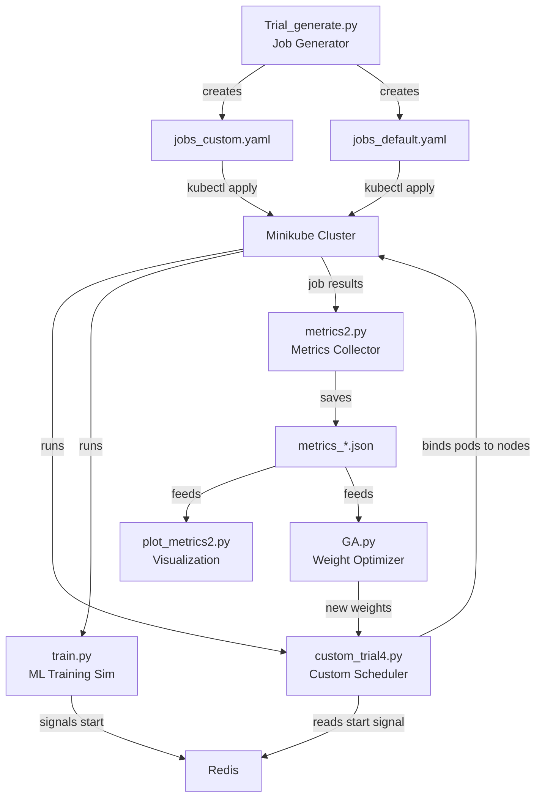
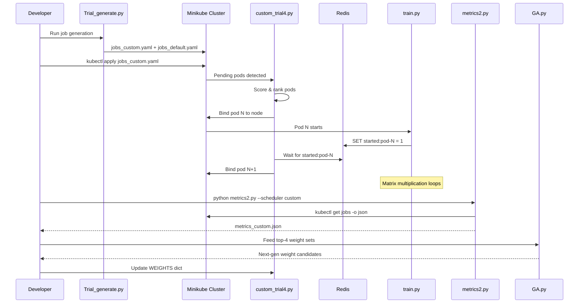

# Codebase Analysis — GA-Optimized Kubernetes ML Job Scheduler

## Project Summary

This is a **Masters-level research project** that implements and evaluates a **custom Kubernetes scheduler for ML training jobs**, using a **Genetic Algorithm (GA)** to optimize the scheduler's feature-weighting parameters. The system runs on a local Minikube cluster and compares the custom scheduler against Kubernetes' default scheduler using real scheduling metrics.

---

## Architecture Overview

---

## Component Breakdown

### 1. Custom Scheduler — [custom_trial4.py](file:///c:/Users/Mary0711/Desktop/FINAL%20MASTERS%20PROJECT/custom_trial4.py) *(latest version)*

The core of the project. A Python-based Kubernetes scheduler that:

| Aspect | Detail |
|--------|--------|
| **Scheduling strategy** | Weighted multi-criteria scoring with burst-level min-max normalization |
| **Features scored** | Train time (T), Loss reduction rate (R), Matrix size (M), Gradient update size (G), Checkpoint interval (C), Model partitions (P) |
| **Weights (GA-optimized)** | T=0.2045, R=0.2309, **M=0.3446** (heaviest), G=0.0804, C=0.0552, P=0.0844 |
| **Pod ordering** | Uses a max-heap `PriorityQueue`; highest score → scheduled first |
| **Execution gating** | Uses Redis to wait for the previous pod to start before binding the next pod (sequential execution) |

Key functions:
- `_extract_features(pod)` — Reads 6 workload features from pod annotations
- `update_feature_stats(pods)` — Computes per-feature min/max across the current burst for normalization
- `_norm(x, key, larger_better)` — Normalizes a feature to [0,1] where 1 = "better"
- `adjust_priority(pod)` — Computes the weighted sum score
- `custom_scheduler()` — Main loop: polls pending pods, scores, orders, and binds

#### Evolution of the Scheduler
There are 4 versions showing incremental development:

| File | Key Difference |
|------|---------------|
| [custom_scheduler.py](file:///c:/Users/Mary0711/Desktop/FINAL%20MASTERS%20PROJECT/custom_scheduler.py) | Original — raw inverse-value priority formula, no normalization |
| [custom_trial.py](file:///c:/Users/Mary0711/Desktop/FINAL%20MASTERS%20PROJECT/custom_trial.py) | Trial 1 |
| [custom_trial2.py](file:///c:/Users/Mary0711/Desktop/FINAL%20MASTERS%20PROJECT/custom_trial2.py) | Trial 2 |
| [custom_trial3.py](file:///c:/Users/Mary0711/Desktop/FINAL%20MASTERS%20PROJECT/custom_trial3.py) | Trial 3 |
| **[custom_trial4.py](file:///c:/Users/Mary0711/Desktop/FINAL%20MASTERS%20PROJECT/custom_trial4.py)** | **Latest** — GA-optimized weights, burst normalization, Redis gating |

---

### 2. ML Training Simulation — [train.py](file:///c:/Users/Mary0711/Desktop/FINAL%20MASTERS%20PROJECT/train.py)

A simulated ML training workload that runs inside each pod:

- Performs **matrix multiplication** (`np.matmul`) using `MATRIX_SIZE × MATRIX_SIZE` random matrices
- Simulates **gradient steps**, **checkpointing**, and **loss convergence**
- Signals its start to **Redis** (`started:{pod_name}`) so the scheduler can gate execution
- Prints `START_TIME_UTC` for the metrics collector to parse

The workload characteristics are controlled by environment variables set from the job annotations.

---

### 3. Genetic Algorithm — [GA.py](file:///c:/Users/Mary0711/Desktop/FINAL%20MASTERS%20PROJECT/GA.py)

Optimizes the 6 scheduler weights using a simple GA:

- **Population**: 8 individuals per generation (1 elite + 7 offspring)
- **Selection**: Top 4 parents from prior experiments
- **Crossover**: Arithmetic crossover with random alpha blending
- **Mutation**: ±0.05 perturbation at configurable rate (0.1 → 0.1)
- **Normalization**: Weights are clipped to ≥0.01 and normalized to sum to 1.0

The workflow is: run experiments → collect metrics → pick top 4 weight sets → run `GA.py` → get next generation → repeat.

---

### 4. Job Generator — [Trial_generate.py](file:///c:/Users/Mary0711/Desktop/FINAL%20MASTERS%20PROJECT/Trial_generate.py)

Generates **48 Kubernetes Job YAMLs** across 4 workload categories:

| Category | Matrix Size | Train Time | Loss Rate | Partitions |
|----------|-------------|------------|-----------|------------|
| **Light** | 250–400 | 5–10s | 0.5–1.0 | 1–2 |
| **Heavy** | 1000–1500 | 20–40s | 0.2–0.5 | 3–5 |
| **I/O** | 500–750 | 15–30s | 0.2–0.5 | 2–4 |
| **Slow** | 400–650 | 25–40s | 0.05–0.1 | 1–3 |

Produces duplicate YAML sets: `jobs_custom.yaml` (with `schedulerName: custom-scheduler`) and `jobs_default.yaml` (using Kubernetes default).

---

### 5. Metrics Collection — [metrics2.py](file:///c:/Users/Mary0711/Desktop/FINAL%20MASTERS%20PROJECT/metrics2.py)

Collects job-level metrics from the live cluster via `kubectl`:
- **JCT** (Job Completion Time): `completionTime − startTime`
- **Waiting Time**: `startTime − creationTime`
- **Flow JCT**: `completionTime − creationTime`
- **Makespan**, **Tail Latency (P95)**, **Throughput**, **Avg Inter-Launch Time (ILT)**

Saves results to `metrics_{scheduler}.json`.

---

### 6. Visualization — [plot_metrics2.py](file:///c:/Users/Mary0711/Desktop/FINAL%20MASTERS%20PROJECT/plot_metrics2.py) / [plot_metrics2_multi.py](file:///c:/Users/Mary0711/Desktop/FINAL%20MASTERS%20PROJECT/plot_metrics2_multi.py)

- Generates **CDF plots** and **bar charts** comparing custom vs default scheduler
- Outputs **LaTeX table snippets** and figure captions (thesis-ready)
- Multi-run version aggregates across multiple experiment JSON files

---

### 7. Infrastructure

| File | Purpose |
|------|---------|
| [Dockerfile-ml](file:///c:/Users/Mary0711/Desktop/FINAL%20MASTERS%20PROJECT/Dockerfile-ml) | Container image for `train.py` (Python 3.9 + numpy + redis) |
| [Dockerfile-scheduler-python](file:///c:/Users/Mary0711/Desktop/FINAL%20MASTERS%20PROJECT/Dockerfile-scheduler-python) | Container image for the custom scheduler (Python 3.9-slim + kubernetes + redis) |
| [redis.yaml](file:///c:/Users/Mary0711/Desktop/FINAL%20MASTERS%20PROJECT/redis.yaml) | Redis deployment/service for inter-pod signaling |
| [custom-scheduler-deployment.yaml](file:///c:/Users/Mary0711/Desktop/FINAL%20MASTERS%20PROJECT/custom-scheduler-deployment.yaml) | Scheduler deployment in `kube-system` namespace |
| [custom-scheduler-rbac.yaml](file:///c:/Users/Mary0711/Desktop/FINAL%20MASTERS%20PROJECT/custom-scheduler-rbac.yaml) | RBAC for pod binding permissions |
| [setup_cluster.sh](file:///c:/Users/Mary0711/Desktop/FINAL%20MASTERS%20PROJECT/setup_cluster.sh) | One-shot Minikube cluster setup |
| [kind-config.yaml](file:///c:/Users/Mary0711/Desktop/FINAL%20MASTERS%20PROJECT/kind-config.yaml) | Alternative Kind cluster config |

---

## Experimental Data

The project contains extensive experiment results:
- **`GA_runs/`** — 34 files of GA generation results
- **`saved metrics/`** — 51 files of saved metric JSONs
- **`Multi_figs_*/`** — Generated comparison plots across multiple runs
- **`T1_*.json`, `el_*.json`** — Individual experiment metric snapshots
- **`results for custom_trial*/`** — Per-version experiment outputs

---

## Workflow

1. **Build images** → `docker build` for scheduler + training
2. **Setup cluster** → `bash setup_cluster.sh` (Minikube + Redis + RBAC)
3. **Generate jobs** → `python Trial_generate.py`
4. **Run custom** → `kubectl apply -f jobs_custom.yaml` → `python metrics2.py --scheduler custom`
5. **Run default** → `kubectl apply -f jobs_default.yaml` → `python metrics2.py --scheduler default`
6. **Compare** → `python plot_metrics2.py` or `python compare_metrics.py`
7. **Evolve** → Feed results into `GA.py`, update weights, repeat
